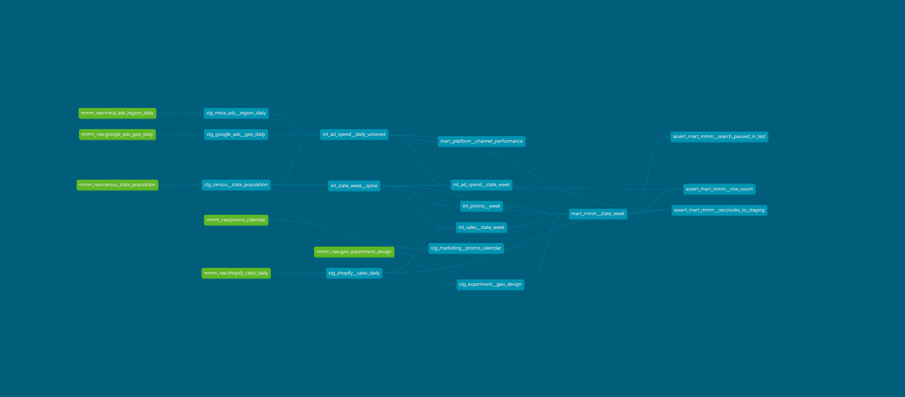

# MMM vs. Experiment: Calibrating a Marketing Mix Model with a Geo Holdout

**Status:** Days 1 to 3 of 5 complete (simulator, BigQuery load, dbt pipeline, uncalibrated Meridian MMM). Geo experiment and calibration next.

Marketing mix models can be confidently wrong, and with real data you never find out,
because the true channel ROIs are unknown. This project builds a simulated DTC e-commerce
brand where the truth is known, plants two realistic failure modes, and tests whether a
geo holdout experiment can correct a Meridian MMM that gets paid search wrong.

**Pipeline:** Python simulator → messy platform exports → BigQuery → dbt → Meridian (uncalibrated)
→ DiD and synthetic control on a geo holdout → Meridian (calibrated with the experiment)
→ compare everything to the truth → Tableau.

## Why simulated data

This is a parameter recovery study: before trusting a model's ROIs, check whether it
recovers effects you planted. Tool builders do this routinely (Google's AMSS simulator,
Meridian's and PyMC-Marketing's demo data). The simulation is the only setting where
"how far off was the MMM?" has an answer.

## The simulated world

A DTC brand selling across the 50 US states (2020 Census populations), 156 weeks from
2023-01-02 to 2025-12-28, about $650M in annual net sales. KPI is weekly net sales by state.

| Channel | True ROI | Adstock decay | Share of revenue | Role in the story |
|---|---|---|---|---|
| Paid search | 1.80 | 0.15 (fast) | 9.5% | Spend follows hidden demand, so a naive MMM overstates it |
| Paid social | 1.40 | 0.40 | 4.8% | Exogenous; the MMM should recover it |
| Online video | 0.80 | 0.65 (slow) | 1.5% | Below breakeven; runs in regional flights |

Baseline demand (84% of revenue) includes seasonality with a December peak, seven
promo events a year, state-level growth trends, and hidden state-level demand shocks.
All parameters live in [`config.py`](config.py); the modeling code never imports it.

## The two failure modes

**1. Endogeneity (paid search).** Search spend rises when people are already searching, so
it moves with demand the model can't see. In the simulator, a hidden AR(1) demand shock
raises baseline sales and raises search spend (elasticity 1.25). The model sees "search
spend up, sales up" and credits search for demand that would have converted anyway.
This can't be spotted in a raw correlation table: search spend and the hidden shock
correlate at 0.02 in levels.

**2. Non-parallel trends (geo experiment).** Paid search is paused for 8 weeks
(2024-06-03 to 2024-07-28) in 10 states picked from a "growth markets" list: mid-sized
states with the fastest trends. Their faster growth violates DiD's parallel-trends
assumption, so DiD understates the loss from pausing search. Other fast-growing states
remain in the donor pool, so synthetic control can still build a matching counterfactual.

The test sits mid-sample on purpose. An MMM's state fixed effects absorb each state's
average level; a pause in fast-growing states near the end of the sample would line up
zero spend with above-average sales and bias the MMM too, mixing the two failure modes.

**Also planted: platform attribution.** Google Ads and Meta report conversion value at
1.6x / 1.3x / 1.1x true incremental value, and only in weeks a channel is live, so
slow-decay video gets under-credited.

## Does the simulator do what it claims?

[`validate_simulation.py`](validate_simulation.py) checks each failure mode on the default
seed and across 20 seeds (full output in [`validation_report.md`](validation_report.md)).

| Check | Truth | Result (seed 42) | Across 20 seeds |
|---|---|---|---|
| Search ROI, oracle regression,* search follows demand | 1.80 | 2.74 | mean 2.81 |
| Search ROI, same regression, search exogenous | 1.80 | 1.83 | mean 1.82 |
| Experiment iROAS, DiD (26-week pre-period) | 1.77 | 1.44 | mean error -0.29 |
| Experiment iROAS, DiD (52-week pre-period) | 1.77 | 1.29 | mean error -0.50 |
| Experiment iROAS, synthetic control | 1.77 | 1.75 | mean error -0.12 |
| Platform-reported ROAS: search / social / video | 1.80 / 1.40 / 0.80 | 2.88 / 1.82 / 0.66 | |

\*Per-capita sales on state and week fixed effects plus the **true** adstock and saturation
transforms. A best case for MMM, not Meridian. If even this is biased by ~50%, the
problem is the data-generating process, not the model's flexibility.

Two things worth noting already: the bias disappears entirely when search spend stops
following demand (so endogeneity is the cause), and a longer DiD pre-period makes the
trend bias worse, not better.

## Raw exports (what the analyst receives)

| File | Grain | Rows | Notes |
|---|---|---|---|
| `google_ads_geo_daily.csv` | day x campaign x state | 144,886 | Search (brand, non-brand) and YouTube; Fivetran-style columns |
| `meta_ads_region_daily.csv` | day x campaign x state | 109,200 | Prospecting and retargeting; Ads Manager headers |
| `shopify_sales_daily.csv` | day x state | 55,692 | Gross sales, discounts, returns, shipping, taxes |
| `promo_calendar.csv` | promo | 21 | Marketing's Google Sheet |
| `geo_experiment_design.csv` | state | 50 | Test/control assignment and dates |
| `census_state_population.csv` | state | 50 | Population for per-capita scaling |

The exports carry realistic quirks for dbt to fix (duplicates, unit and sign conventions,
geo naming, missing zero-spend rows, week boundaries). They are listed in
[`docs/known_data_issues.md`](docs/known_data_issues.md), which is a spoiler: profile the
raw tables first.

Ground truth goes to `data/truth/` and the `mmm_truth` BigQuery dataset, used only for
evaluation.

## dbt pipeline (BigQuery)



Thirteen models in three layers turn the raw exports into two tested marts:

| Layer | Models | What happens |
|---|---|---|
| Staging (views) | 6, one per source | Cast dates, convert Google's micros to dollars, dedupe a re-pulled week, standardize column names, label channels, compute net sales (gross + discounts + returns), flag rows with no state instead of dropping them |
| Intermediate (views) | 5 | A state x Monday-week grid; Google and Meta stacked into one daily table; spend, sales, and promo days rolled up to weeks and zero-filled from the grid, so the search pause shows as $0 rather than missing weeks |
| Marts (tables) | 2 | `mart_mmm__state_week`: 7,800 rows of KPI, spend by channel, promo share, and experiment flags (contract-enforced; read by Meridian). `mart_platform__channel_performance`: platform-reported ROAS by channel and week |

About 100 tests guard the pipeline, including three custom ones on the MMM mart: exact row
count, totals that reconcile to staging within a cent, and $0 search spend wherever the
experiment design says search was paused. In production I'd start the ad-platform staging
layer from Fivetran's `ad_reporting` package; here it's written by hand because the
exports don't follow Fivetran's schemas.

## Meridian v1: the uncalibrated MMM

Google Meridian 2.1, geo-level, fit on `mart_mmm__state_week` (50 states x 156 weeks).
KPI is net sales, so ROI is in dollars per dollar. The exports have no impressions, so
spend is both the media input and the ROI denominator. Priors are Meridian's defaults:
the same ROI prior for every channel (LogNormal(0.2, 0.9), median 1.22, 90% range
0.28 to 5.37), up to 8 weeks of adstock, and one time effect per week. Sampling: 4 chains,
each with 2,000 adaptation, 1,000 burn-in, and 1,000 kept draws (about 25 minutes on a laptop CPU).

**Key decision: no promo control.** Promotions are national, so `promo_share` is
identical across states in any given week and perfectly collinear with the weekly time
effects (Meridian refuses to fit with it). The time effects absorb promos and
seasonality instead. The experiment flags are not used in v1.

| Channel | True ROI | Meridian v1 (90% credible interval) | Error | Interval covers truth? |
|---|---|---|---|---|
| Paid search | 1.80 | 2.45 (2.24 to 2.68) | +36% | **No** |
| Paid social | 1.40 | 1.79 (1.36 to 2.35) | +28% | Yes, barely |
| Online video | 0.80 | 0.95 (0.64 to 1.35) | +19% | Yes |

- **Paid search is confidently wrong.** The whole interval sits above the truth. This is
  the endogeneity failure: nothing in the data tracks the hidden demand that drives both
  search spend and sales, so more data or longer sampling cannot fix it.
- **Social and video are high too,** although neither follows demand. That is consistent
  with the shared default prior (mean 1.83) pulling weakly identified channels upward;
  [`outputs/roi_vs_truth.csv`](outputs/roi_vs_truth.csv) shows each posterior next to its prior mean.
- **Video is the costly miss.** It truly loses money (0.80), but v1's interval runs up to
  1.35, so v1 alone would not tell you to cut it.
- **Fit is not attribution.** In-sample R² is 0.997 by state and national MAPE is 0.8%.
  The model tracks sales almost perfectly while misallocating credit between channels.

**Convergence.** All media parameters converged (R-hat ≤ 1.02, except 1 of 150
state-level coefficients at 1.11). The weekly time effects did not fully converge
(R-hat 1.23): with one effect per week, the baseline level is weakly identified against
the state intercepts. Per-chain ROI estimates agree within 0.03 (search) to 0.10 (social),
small next to the 90% intervals, so the channel conclusions do not depend on it.
Longer sampling (2,500 to 4,000 steps per chain) reduced the time-effect R-hat from 1.36
to 1.23 and moved no ROI by more than 0.04. I stopped there rather than tighten priors until the
diagnostic passed.

## Running it

Windows PowerShell (on macOS/Linux, use `python3.11 -m venv .venv` and `source .venv/bin/activate`):

```powershell
py -3.11 -m venv .venv
.venv\Scripts\Activate.ps1
pip install -r requirements.txt

python simulate.py              # writes data/raw and data/truth (seed 42, ~1 second)
python validate_simulation.py   # writes validation_report.md (~10 seconds)

# One-time: credentials for Python libraries (separate from `gcloud init`)
gcloud auth application-default login
gcloud auth application-default set-quota-project YOUR_GCP_PROJECT

python load_to_bigquery.py --project YOUR_GCP_PROJECT --dry-run   # local only, no BigQuery calls
python load_to_bigquery.py --project YOUR_GCP_PROJECT
```

Then build and test the dbt project (connection set up with `dbt init`, oauth method):

```powershell
cd mmm_dbt
dbt deps
dbt build              # all models and tests
dbt docs generate      # docs site + lineage graph
dbt docs serve
```

Meridian runs in its own virtual environment because its TensorFlow and JAX pins can
conflict with dbt's dependencies. Export `mmm_dbt.mart_mmm__state_week` from BigQuery to
`data/mart_mmm__state_week.csv` first, then, from the project root:

```powershell
py -3.11 -m venv .venv-meridian
.venv-meridian\Scripts\Activate.ps1
pip install -r requirements-meridian.txt

python meridian/fit_meridian_v1.py     # about 25 min on a laptop CPU; writes outputs/
python meridian/compare_to_truth.py    # writes outputs/roi_vs_truth.csv
```

BigQuery sandbox notes: tables expire after 60 days (rerun the loader, everything is
seeded), and DML isn't supported, so dbt models should be `table` or `view`, not
`incremental`.

## Repo layout

```
config.py                  ground-truth parameters (evaluation only)
simulate.py                true world + messy raw exports
validate_simulation.py     checks the failure modes exist
load_to_bigquery.py        lands raw + truth tables in BigQuery
validation_report.md       output of the validation script
docs/known_data_issues.md  planted data quality issues (spoilers)
docs/lineage.png           dbt lineage graph
requirements-meridian.txt  pinned packages for the Meridian environment
meridian/
  fit_meridian_v1.py       uncalibrated Meridian fit, diagnostics, ROI summary
  compare_to_truth.py      ROI estimates vs ground truth (the only modeling script that reads truth)
outputs/                   ROI summaries and truth comparison (fitted model files are git-ignored)
mmm_dbt/
  models/staging/          one cleaned view per raw source
  models/intermediate/     weekly rollups on a state x week grid
  models/marts/            MMM input table + platform performance table
  tests/                   custom tests (row count, reconciliation, experiment check)
```

## Roadmap

- **Day 2 (done):** dbt project: staging, intermediate, and marts, with tests and docs
- **Day 3 (done):** Meridian v1 (uncalibrated): convergence checks, ROI recovery vs. truth
- **Day 4:** DiD and synthetic control on the holdout; Meridian v2 with the experiment as a search ROI prior
- **Day 5:** Tableau (ROI recovery, experiment lift, budget reallocation) and the write-up
